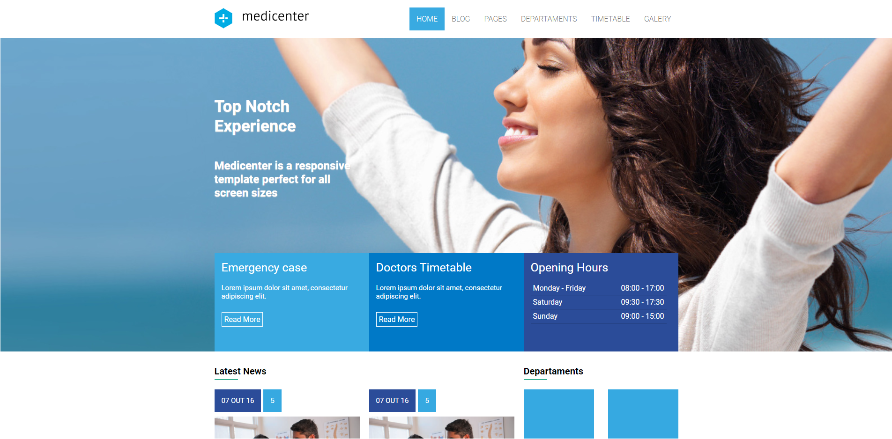
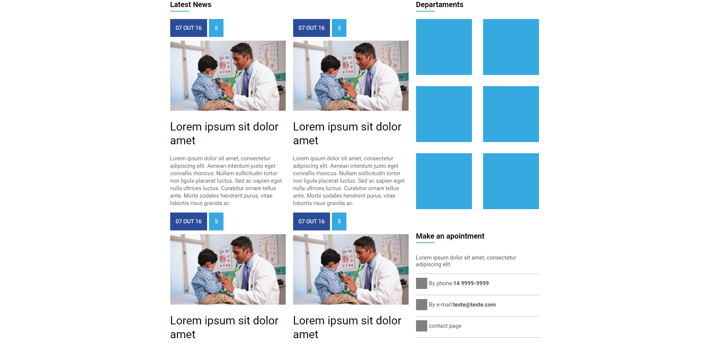

## MEDICENTER


## Descrição do Projeto
Esse projeto foi realizado com fins didáticos no Curso de HTML e CSS da [B7 Web](https://b7web.com.br/fullstack/), sendo o mesmo um clone de um template chamado [Medicenter](https://themeforest.net/item/medicenter-responsive-medical-wordpress-theme/4718613?gclid=Cj0KCQjwnoqLBhD4ARIsAL5JedLBnq4eNs6kJKe1q5WIeA7NZhpGkiJcVoghBqynZ2_DvcSHBA4JYJwaAlhHEALw_wcB)
Créditos e Direitos do layout: [QuanticaLabs](https://quanticalabs.com/home/)

### Pré-requisitos

Antes de começar, você vai precisar ter instalado em sua máquina as seguintes ferramentas:
[Git](https://git-scm.com). 
Além disto é bom ter um editor para trabalhar com o código como [VSCode](https://code.visualstudio.com/)

### 🎲 Rodando a Projeto

```bash
# Clone este repositório
$ git clone <https://github.com/felippepg/medicenter>

# Acesse a pasta do projeto no terminal/cmd
$ cd medicenter

# Abrir o arquivo index.html com algum navegador
```

### :computer: Layout


<h1 align="center">
    
</h1>

<p align="center">Parte superior do Layout final</p>

<h1 align="center">
    
</h1>

<p align="center">Parte inferior do Layout principal</p>


## :iphone: Responsividade

<h1 align="center">
    
</h1>

<p align="center">Site projetado em um Tablet</p>

<h1 align="center">
    
</h1>

<p align="center">Site projetado em um Smartphone</p>


## 🛠 Tecnologias

As seguintes tecnologias foram usadas na construção da API:

- HTML
- CSS
- JAVASCRIPT
- FLEXBOX
- LAYOUT RESPONSIVO
